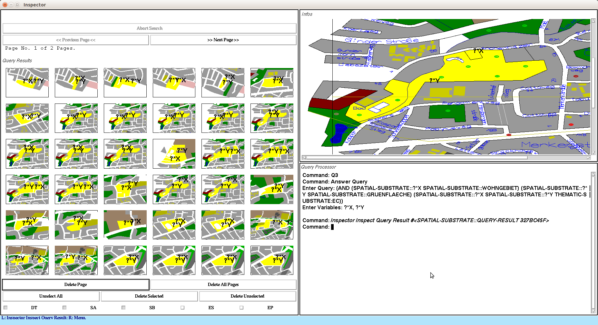
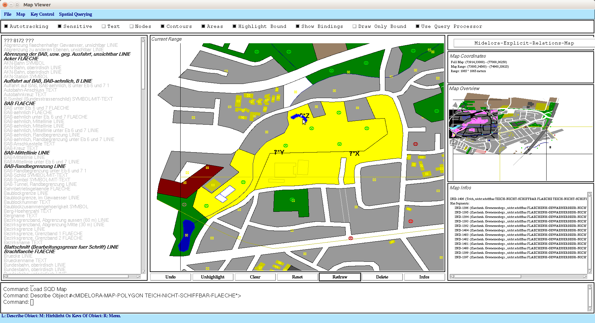
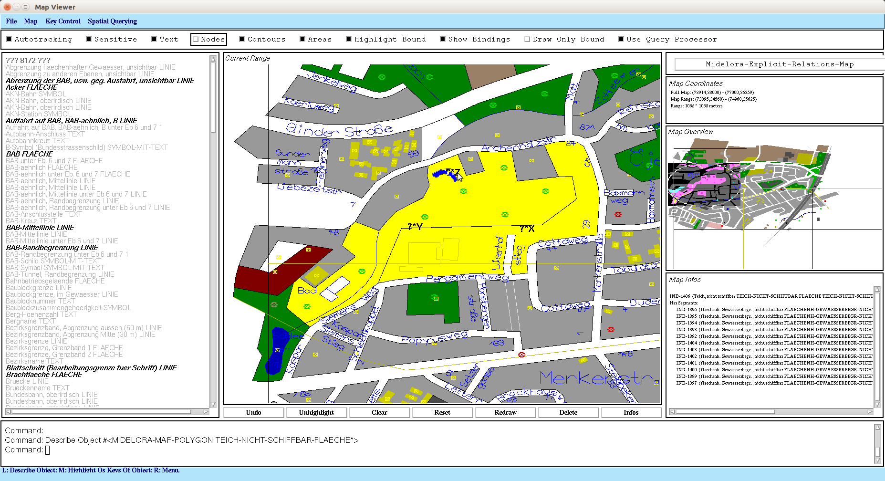

# DLMAPS
DLMAPS = Description Logic Maps: Ontology-Based Spatial Queries to Digital City Maps

## About

Another piece of Common Lisp & CLIM (Common Lisp Interface Manager)
legacy software from my quarter century-old Lisp archive :-) It still
works flawlessly in 2021. Tested with LispWorks 6.1 & CLIM on Ubuntu,
32bit Motif port. Not sure about Windows.

A prototypical ontology-based spatial information system, capable of
answering complex ontology-based spatial queries. The program /
framework was written between 2003 and 2005, as part of my PhD thesis.
Here you can find [more details about
DLMAPS](https://www.michael-wessel.info/dlmaps.html), including
publications.

DLMAPS was written in 2003 - 2005, and can be considered the first
hybrid ontology-based geographical information system that relies on
Description Logic reasoning. In a sense, its spatio-thematic query
language is an ancient predecessor of GeoSPARQL. It features a rich
ontology-based spatial query language to so-called
"substrates". Substrates subsume Description Logic ABoxes, RDFs
graphs, property graphs, and other graph-like knowledge representation
structures. A unique feature of the substrate data model is that their
nodes are not simply symbols, but can have complex structure, i.e.,
are geometric objects (polygons, lines, points) in an Euclidean
(geometric) space. This complex (geometric, metric, topological)
structure / space can then be queried with a complex ontology-based
query language. DLMAPS' query language encompasses vocabulary and
expressive means for formulating qualitative spatial relationships
(RCC relations), as well as metric, geometric, and thematic
constraints.

The software in this repository is a cut-down version of the original
DLMAPS. The full version was also capable of using the Racer
description logic reasoner for ABox query answering (i.e., in a hybrid
way). Here, a special-purpose Description Logic reasoner, called
"MiDeLoRa" (for Michael's Description Logic Reasoner), is used for
answering the ontology-based parts of the queries instead. MiDeLoRa's
ABox is a special geometric map substrate in this instantiation; i.e.,
the ABox nodes / individuals are geometric objects, and their spatial
properties are hence intrinsicially ("analogical") represented, and
can be queried. 

Here are some pictures for illustration: 

## Papers 

[See the DLMAPS homepage.](https://www.michael-wessel.info/dlmaps.html), including publications. 

## Usage / Loading

Adjust the logical pathname translations in `dlmaps-sysdcl.lisp` to
match your environment. Then, simply do a load, and start the program
with `(dlmaps)` followed by `(dlmaps-demo)`. Load the `maps\va4.sqd`
map, and enter one of 20 pre-defined queries `q1` to `q19` into the
"Query Inspector".

