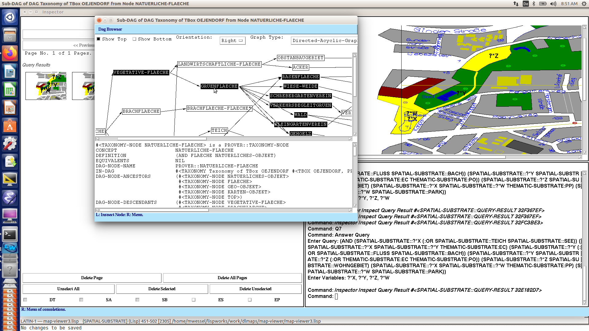
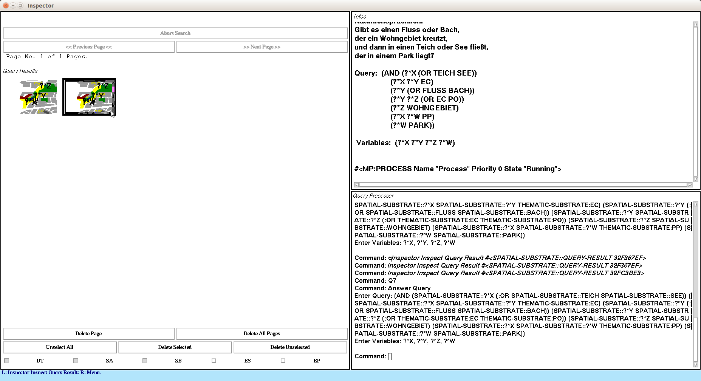
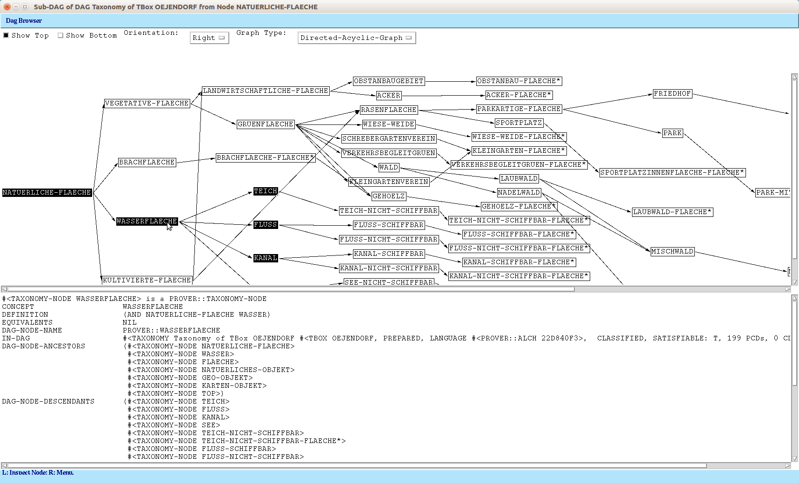
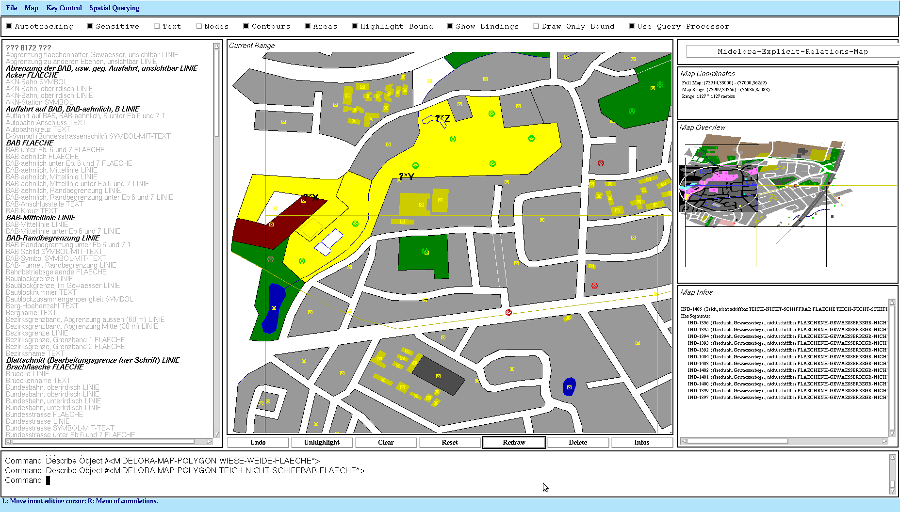
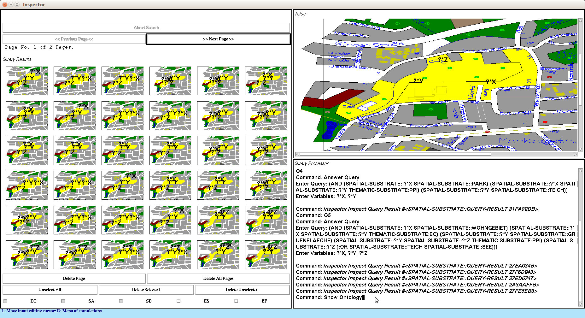
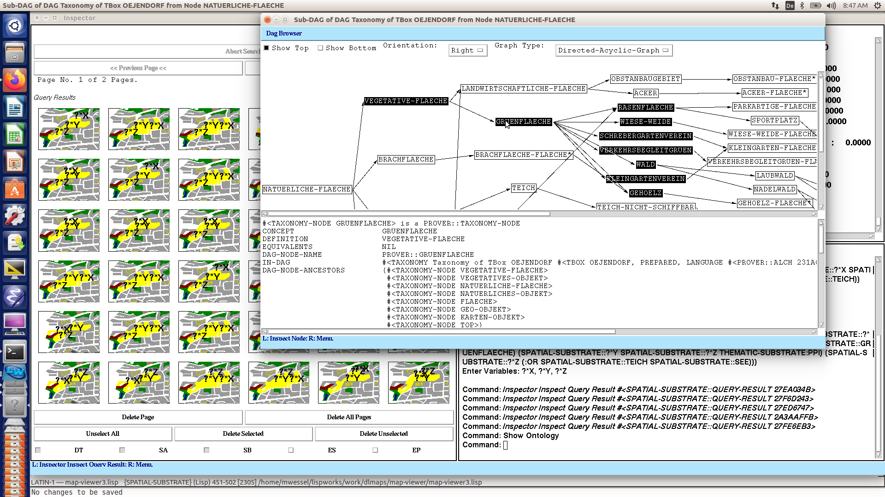
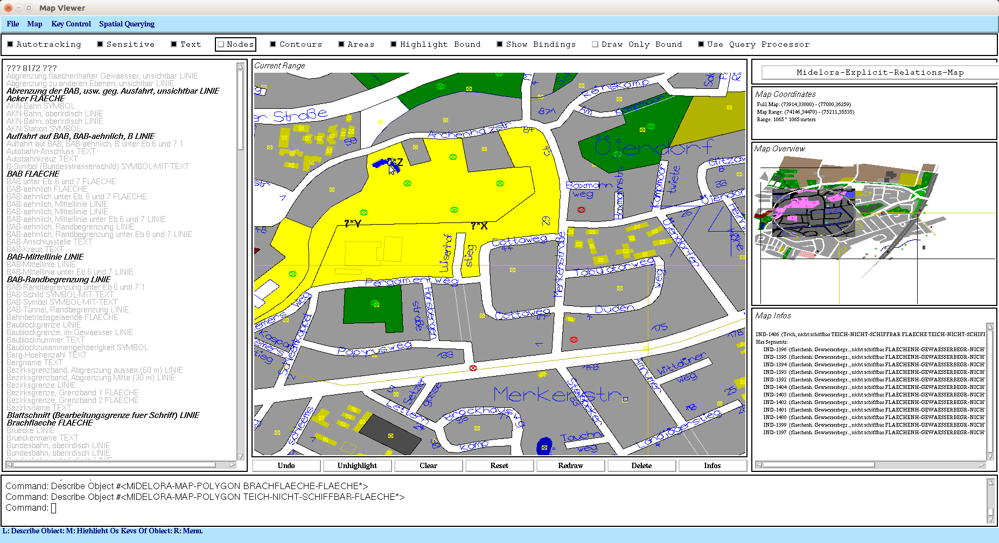

# DLMAPS
DLMAPS = Description Logic Maps: Ontology-Based Spatial Queries to Digital City Maps

## About

Another piece of Common Lisp & CLIM (Common Lisp Interface Manager)
legacy software from my quarter century-old Lisp archive :-) It still
works flawlessly in 2021. Tested with LispWorks 6.1 & CLIM on Ubuntu,
32bit Motif port. Not sure about Windows.

A prototypical ontology-based spatial information system, capable of
answering complex ontology-based spatial queries. The program /
framework was written between 2003 and 2005, as part of my PhD thesis.
Here you can find [more details about
DLMAPS](https://www.michael-wessel.info/dlmaps.html), including
publications.

DLMAPS can be considered the first hybrid ontology-based geographical
information system that relies on Description Logic reasoning. *In a
sense, its spatio-thematic query language is an ancient predecessor of
GeoSPARQL.* It features a rich ontology-based spatial query language to
so-called "substrates". Substrates subsume Description Logic ABoxes,
RDFs graphs, property graphs, and other graph-like knowledge
representation structures. A unique feature of the substrate data
model is that their nodes are not simply symbols, but can have complex
structure, i.e., are geometric objects (polygons, lines, points) in an
Euclidean (geometric) space. This complex (geometric, metric,
topological) structure / space can then be queried with a complex
ontology-based query language. DLMAPS' query language encompasses
vocabulary and expressive means for formulating qualitative spatial
relationships (RCC relations), as well as metric, geometric, and
thematic constraints.

The software in this repository is a cut-down version of the original
DLMAPS. The full version was also capable of using the Racer
description logic reasoner for ABox query answering (i.e., in a hybrid
way). Here, a special-purpose Description Logic reasoner, called
"MiDeLoRa" (for Michael's Description Logic Reasoner), is used for
answering the ontology-based parts of the queries instead. MiDeLoRa's
ABox is a special geometric map substrate in this instantiation; i.e.,
the ABox nodes / individuals are geometric objects, and their spatial
properties are hence intrinsicially ("analogical") represented, and
can be queried. 

DLMAPS is an instantiation of a general framework: the **substrate
representation, reasoning, and querying framework**, as described in
my 2005 PhD thesis. Another instantiations of this framework was used
for realizing the **new Racer Query Language (nRQL)** of the Racer OWL
/ Description Logic reasoner. nRQL was first included with Racer in ~
2004. Racer is OpenSource these days as well:
[https://github.com/ha-mo-we/Racer/](https://github.com/ha-mo-we/Racer/).

nRQL / DLMAPS provided the first Description Logic ABox expressive,
conjunctive query language with an [evaluation cost / heuristic query
optimizer](https://github.com/lambdamikel/DLMAPS/blob/main/src/query/optimizer21.lisp)
that drastically (i.e., by several orders of magnitude) improved query
performance. Later, other researchers have applied these ideas to
SPARQL and analyzed these ideas somewhat more theoretically. Somehow,
our papers on ABox query answering and optimization never got cited by
certain folks, even though our documented and within Racer
implementated ideas predated subsequent work on SPARQL and GeoSPARQL
optimization by years... anyhow, this is history :-)

But back to DLMAPS: 



Here are a few example queries (these can directly be entered into 
the "Query Inspector" by typing their respective function names;
these pre-defined queries are in the files 
[`src/map-viewer/q-queries.lisp`](./src/map-viewer/q-queries.lisp)): 

```
(defun q1 ()
  (let ((q '(?*x wohngebiet))
        (v '(?*x)))

    (inspector-answer-query q v
                            "Show all residential areas.")))

(defun q3 ()
  (let ((q 
	 '(and 
	   (?*x wohngebiet)
	   (?*y gruenflaeche)
	   (?*x ?*y ec)))
        (v '(?*x ?*y)))

    (inspector-answer-query q v "Show all residential areas that have
                                 some adjacent (EC Externally
                                 Connected) green areas.")))

(defun q7 ()
  (let ((q 
	 '(and (?*x (or teich see)) 
	   (?*x ?*y ec)
	   (?*y (or fluss bach))
	   (?*y ?*z (or ec po)) 
	   (?*z wohngebiet) 
	   (?*x ?*w pp)
	   (?*w park)))
        (v '(?*x ?*y ?*z ?*w)))

    (inspector-answer-query q v
                            "Environmental protection monitoring: Show
                            all creeks or rivers that cross (RCC
                            relation EC or PO) a residential area that
                            flows into a lake or pond that is
                            contained in a park. ")))

(defun q12 ()
  (let ((q
         `(?*x 
	   (and 
	    wohnen
	    (some ec
		  (and wiese-weide
		       (or (some tppi teich-nicht-schiffbar)
			   (some ntppi teich-nicht-schiffbar))))
	    (or (some tppi oeffentliches-gebaeude)
		(some ntppi oeffentliches-gebaeude))
	    (all ec (or wiese-weide parkplatz)))))
        (v '(?*x)))

    (inspector-answer-query q v
                            "Identify high quality residential areas:
                            Show all residential areas containing some
                            buildings (RCC relation TPPI union NTPPI)
                            that have an adjacent (RCC relation EC)
                            meadow that contains a lake or
                            pond. Moreover, all areas adjacent to the
                            residential area have to be parking lots
                            or meadows.")))

(defun q13 ()
  (let ((q 
	 '(and (?*wohngebiet wohngebiet)
	   (?*u-bahn-station u-bahn-station)
	   (?u-bahn-station ?wohngebiet (:inside-epsilon 100))
	   (?*wohngebiet ?*teich :contains)
	   (?*teich (or teich see))))
        (v '(?*wohngebiet ?*u-bahn-station ?*teich)))

    (inspector-answer-query q v 
			    "Identify high quality residential areas:
                            Show all residential areas containing a
                            lake or pond, such that a subway station
                            is close by, i.e., in the vicinity of 100
                            meters around the epsilon buffer area of
                            the living area `(:inside-epsilon 100)`.")))


(defun q14 ()
  (let ((q 
	 '(and 
	   ;; note: Q operator not implemented in MIDELORA: 
	   ;; (?*x (and wohngebiet (at-least 8 ntppi gebaeude)))
	   ;; hence: 
	   (?*x (and wohngebiet (at-least 8 ntppi top)))
	   (?x (:satisfies 
		(and (geometry::is-geom-polygon-p object)
		     (> (geometry:calculate-area object) 50000))))))
        (v '(?*x)))

    (inspector-answer-query q v
                            "Show all residential areas that have an
                            area of at least 50000 m^2 and contain at
                            least 8 buildings (RCC relation
                            NTPPI).")))


(defun q17 ()
  (let ((q 
	 '(and 
	   (?*wohngebiet wohngebiet)
	   (?*wohngebiet (ALL EC (not (or industrie gewerbe))))
	   (?*wohngebiet ?*gebaeude :contains)
	   (?*gebaeude gebaeude)
	   (?kirche ?wohngebiet (:inside-epsilon 200))
	   (?*u-bahn-station u-bahn-station)
	   (?u-bahn-station ?wohngebiet (:inside-epsilon 100))
	   (?*wohngebiet ?*teich :contains)
	   (?*teich (or teich see))
	   (?*kirche kirche)))
        (v
         '(?*wohngebiet 
           ?*gebaeude
           ?*kirche 
           ?*u-bahn-station
           ?*teich)))

    (inspector-answer-query q v
                            "Show all residential areas such that all
                             adjacent are NOT industrial areas /
                             industrial parks, and it contains some
                             buildings. Moreover, we require that it
                             contains a lake or pond, and that a
                             subway station and a church are close
                             by (within the area's 100-meter
                             resp. 200-meter outer epsilon buffer
                             area).")))
```

Here are some pictures for illustration: 













## Papers 

[See the DLMAPS homepage.](https://www.michael-wessel.info/dlmaps.html)

## Usage / Loading

Adjust the logical pathname translations in `dlmaps-sysdcl.lisp` to
match your environment. Then, simply do a load, and start the program
with `(dlmaps)` followed by `(dlmaps-demo)`. Load the `maps/va4.sqd`
map from the "Map Viewer" via "Load SQD Map" menu. When the map has
loaded, go to the "Query Inspector" frame / window. Here, you can
enter one of 20 pre-defined queries and get it executed, simply type
`q1` to `q19` into the "Query Processor" console pane. Some queries
(e.g., `q17`) will take some time to execute the first time. Also,
queries that use an `(all ...)` quantifier will require that you
"close the roles" first - this can be done right after the SQD map was
loaded, using the menu item "Close Roles" from the "Map Viewer"
menu. Enjoy!
